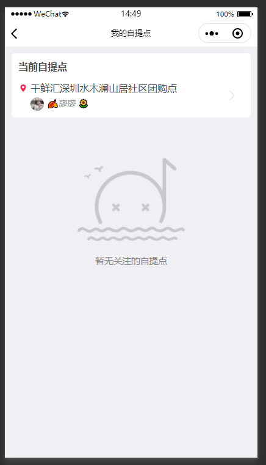
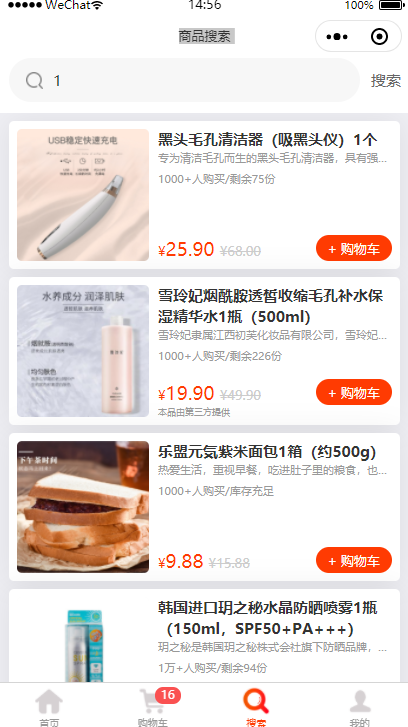
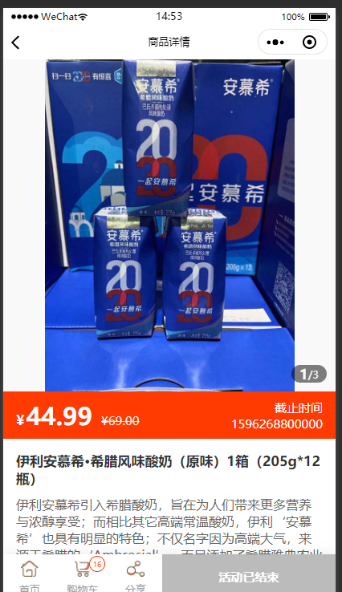
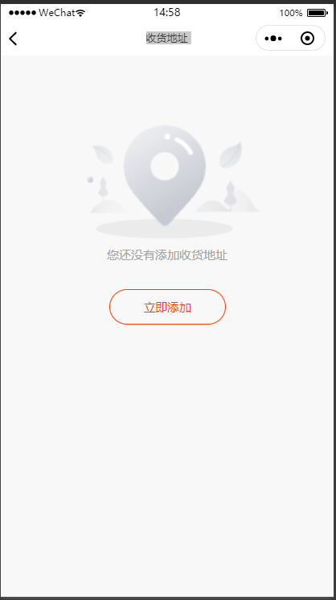
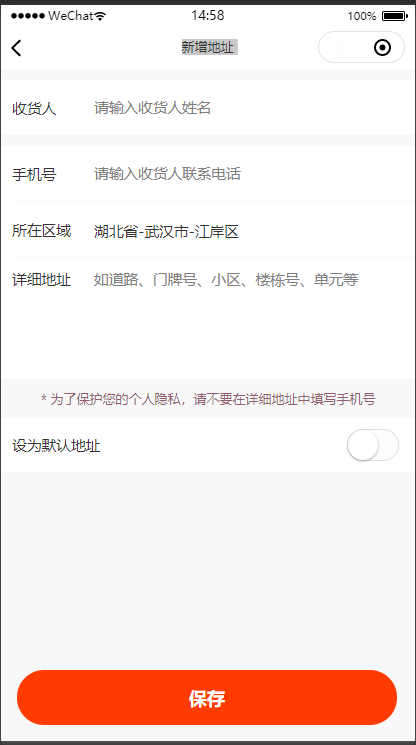
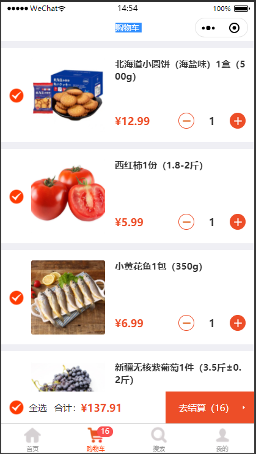
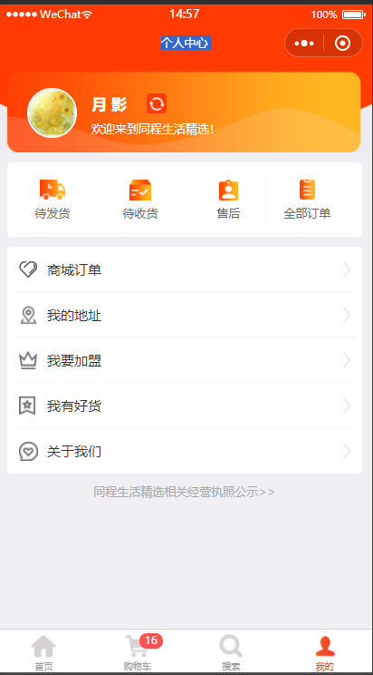

# 社区电商系统

## 1.总纲以及现有接口分析

基础的组织架构
社区通常分为许多不同省市区街道下的不同社区,为每个社区设置`队长/管理人(Distribut)`,并且定期`发布采购活动(Topic)`,用户可以根据扫码中分享人信息(shareUserId,userId)来确定负责人和隶属社区,取货点等信息

###  首页和提取点页面

  
  
  

###  搜素产品页面和产品详情页面

 

### 我的收货地址页面和添加收货地址页面

  
  

### 个人中心页面和购物车页面

  
  

---

用户会先登录(login),具体是通过微信给的code来给服务端,服务端会获取用户的openid+apppid的组合来确定用户的信息(openid是相对于某个具体app中的用户,而unionId是相对某个开发者所有的app的具体用户)
 
---

|接口名称|接口描述|
---|---
|登录接口|[https://market.airuanjian.vip/api/#/admin/UserController_login](https://market.airuanjian.vip/api/#/admin/UserController_login)|
|确定用户绑定接口|[https://market.airuanjian.vip/api/#/shop/CommissionController_share_user_rights](https://market.airuanjian.vip/api/#/shop/CommissionController_share_user_rights)|
|拉取当前的社区信息|[https://market.airuanjian.vip/api/#/shop/TopicController_list_pickup](https://market.airuanjian.vip/api/#/shop/TopicController_list_pickup)|
|拉取购物车信息|[https://market.airuanjian.vip/api/#/shop/OrderController_cart_info](https://market.airuanjian.vip/api/#/shop/OrderController_cart_info)|
|基本信息|[https://market.airuanjian.vip/api/#/shop/TopicController_baseinfo](https://market.airuanjian.vip/api/#/shop/TopicController_baseinfo)|
|拉取商品列表|[https://market.airuanjian.vip/api/#/shop/TopicController_page_goods](https://market.airuanjian.vip/api/#/shop/TopicController_page_goods)
|拉取商品详情|[https://market.airuanjian.vip/api/#/shop/TopicController_get_goods](https://market.airuanjian.vip/api/#/shop/TopicController_get_goods)
|购物车信息|[https://market.airuanjian.vip/api/#/shop/OrderController_cart_info](https://market.airuanjian.vip/api/#/shop/OrderController_cart_info)
|选择商品并准备支付接口|[https://market.airuanjian.vip/api/#/shop/TopicController_pickup_for_post](https://market.airuanjian.vip/api/#/shop/TopicController_pickup_for_post)

基本信息的topic_info会显示在页面内容顶部的当前活动名称和活动标题和以及 提取点信息中
category_info会显示在分类图标列表中

