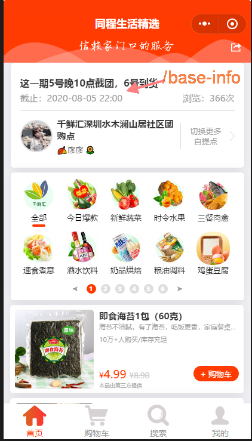

### 用户登录和首页




1. 当用户扫描二维码或点击打开微信小程序时候,小程序启动运行时候会判断当前链接中是否有`shareUserId` 该查询参数(query),如果有shareUserId,则发出请求,绑定上级


`/app.js` line:82
```javascript
 onShow: function(n) {
    // n.query = (0, util.getOptions)(n.query); // util.getOptions(n.query) || 0
    n.query=util.getOptions(n.query) || 0;
    wx.removeStorageSync("newShopCarList");
    var shareUserId = n.query.u || n.query.s || 0;
    // shareUserId > 0 && (wx.setStorageSync("shareUserId", shareUserId), (0, t.bindShareId)(shareUserId));
    if(shareUserId>0){
      wx.setStorageSync('shareUserId', shareUserId);
      shareUtils.bindShareId(shareUserId);
    }
  },
```

`/utils/shareUserUtils.js`  line:96
```js

 var bindShareId = t(r.default.mark(function e(t) {
      var a;
      return r.default.wrap(function(e) {
          for (;;) switch (e.prev = e.next) {
            case 0:
              return a = {}, e.prev = 1, e.next = 4, n.default.GET(u.default.service.shareUserRights + "?user_id=" + wx.getStorageSync("userid") + "&share_user_id=" + t);

            case 4:
              a = e.sent, e.next = 10;
              break;

            case 7:
              e.prev = 7, e.t0 = e.catch(1), a = e.t0;

            case 10:
            case "end":
              return e.stop();
          }
      }, e, void 0, [ [ 1, 7 ] ]);
  }));
```


2. 小程序默认页面是 `/pages/relay/relay`  从`/app.json`得知 页面进入时也会绑定分享用户id,有可能是两种不同的进入方式,走同一个分享接口

`/pages/replay/replay.js` line:83
```javascript
  onLoad: function (query) {
    query = u.getOptions(query ? query : {});
    this.setData({
      topic_id: e.num || 0,
      pickupId: e.pickup_id || 0,
      type_id: e.typeid || 0
    });
    wx.showLoading({
      title: "加载中..."
    });
    let a = this;
    o.default().then(t => {
      a.selfUserId = wx.getStorageSync("userid");
      a.userid = e.userid;
      if (a.userid && "undefined" != a.userid && a.selfUserId && a.setShareUser(),
        a.data.topic_id && a.data.pickupId) {
        this.setData({
          pickupName: f.globalData.pickup_name
        })
      }
      a.upDateAddressApi(), void a.pageInit();
      a.getPopData();
    })

  },


  setShareUser: function () {
    var t = this;
    return e(r.default.mark(function e() {
      var a;
      return r.default.wrap(function (e) {
        for (;;) switch (e.prev = e.next) {
          case 0:
            return a = {}, e.prev = 1, e.next = 4, i.default.GET(n.default.service.shareUserRights + "?user_id=" + t.selfUserId + "&share_user_id=" + t.userid);

          case 4:
            a = e.sent, e.next = 10;
            break;

          case 7:
            e.prev = 7, e.t0 = e.catch(1), a = e.t0;

          case 10:
          case "end":
            return e.stop();
        }
      }, e, t, [
        [1, 7]
      ]);
    }))();
  },
  ```


  首页初始化时拉取必要信息

  |方法名|api|
  ---|---
  |getRollImage|

  ```javascript
    pageInit: function () {
    var t = this;
    return e(r.default.mark(function e() {
      return r.default.wrap(function (e) {
        for (;;) switch (e.prev = e.next) {
          case 0:
            if (t.data.topic_id || f.globalData.topic_id) {
              e.next = 7;
              break;
            }
            return t.setData({
                pageLoad: !0,
                noTopic: !0
              }), t.goPickupList(), wx.hideLoading(), wx.hideNavigationBarLoading(), wx.stopPullDownRefresh(),
              e.abrupt("return");

          case 7:
            return t.setData({
              topic_id: t.data.topic_id || f.globalData.topic_id
            }), e.next = 10, (0, g.default)(t.data.topic_id);

          case 10:
            return f.globalData.pickup_id = t.data.pickupId, f.globalData.topic_id = t.data.topic_id,
              e.next = 14, t.getCarInfo();

          case 14:
            t.getRollImage(), t.getCommonAds(), t.getPlayData(), t.getTopicInfo(), t.getOrderBg(),
              t.getAds();

          case 20:
          case "end":
            return e.stop();
        }
      }, e, t);
    }))();
  },
```